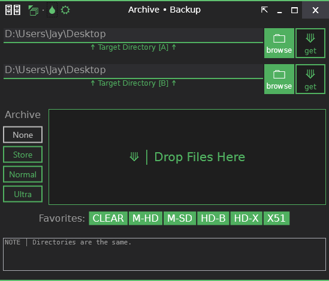

# Archive - Backup (WPF)
**Last Updated:** 12 February 2014

This is the code repository for a WPF app called "Archive - Backup". 
It archives (optiona: and compresses) a selected folder, the backs it up to a target destination.

This app uses my own Window template which includes:
- Dark/White Theme
- Color Schemes
- Always On-Top option.
- In-place Collapse/Expand
